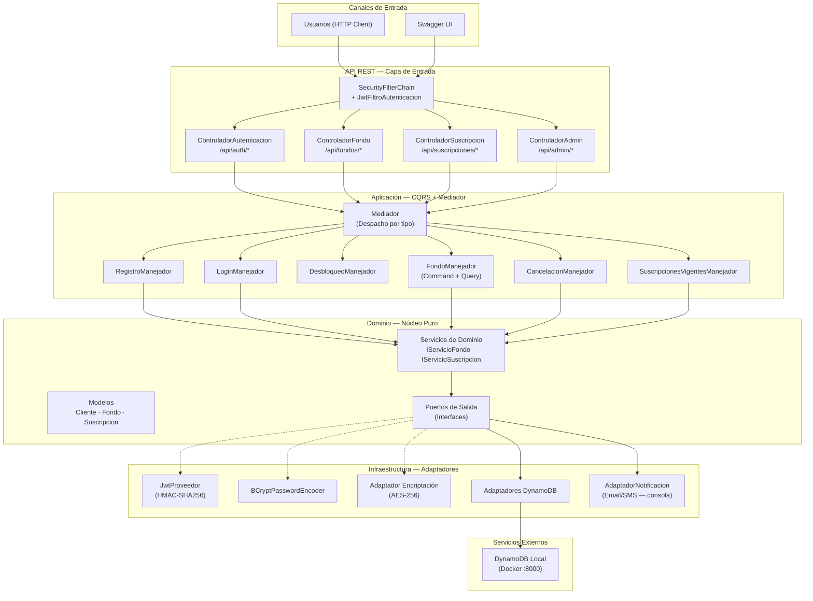
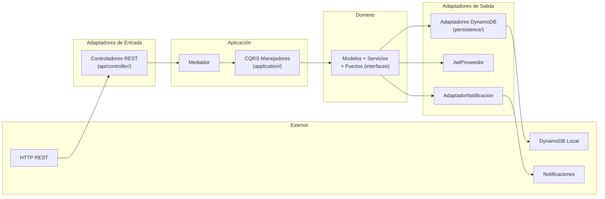
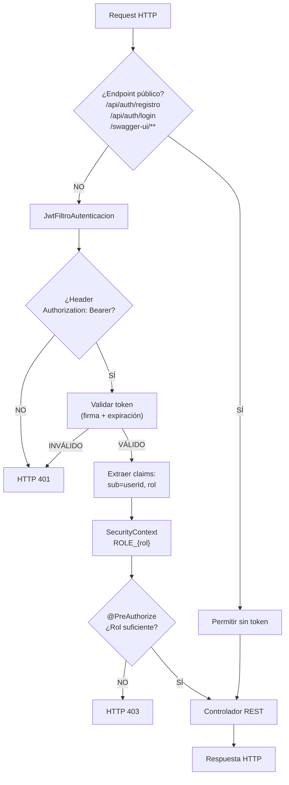

# Arquitectura del Sistema - GPS Principal

Este documento sirve como **GPS arquitectónico** para orientar decisiones de diseño y desarrollo en el sistema BTG Pactual V2.

## 🎯 **Resumen Ejecutivo**

### Propósito y alcance del sistema

**BTG Pactual V2** es un sistema backend de gestión de fondos de inversión que permite:

- **Registro de usuarios** con modelo de credenciales (email/contraseña, validación de unicidad, política de contraseña)
- **Autenticación JWT stateless** con política de bloqueo automático (3 intentos fallidos consecutivos)
- **Autorización RBAC** con roles `CLIENTE` y `ADMINISTRADOR`, aislamiento de datos por usuario (prevención BOLA)
- **Suscripción a fondos de inversión** con validación de saldo mínimo y descuento automático
- **Cancelación de suscripciones** con reembolso de saldo
- **Consulta de suscripciones vigentes** filtradas por cliente autenticado
- **Notificación por email/SMS** (fire-and-forget) tras operaciones de suscripción/cancelación
- **Encriptación de datos sensibles** en reposo (saldos con AES-256, contraseñas con BCrypt)

La persistencia utiliza Amazon DynamoDB Local con AWS SDK v2 Enhanced Client. Tests E2E e integración usan Testcontainers.

### Dominios y repositorios críticos

- **Dominio principal:** Fondos de inversión — suscripción, cancelación, consulta
- **Dominio de seguridad:** Autenticación JWT, autorización RBAC, bloqueo de cuentas, encriptación
- **Dominio de notificación:** Email/SMS fire-and-forget
- **Repositorio único:** `BTG_Pactual_V2` (monolito modular hexagonal)
- **Límites del sistema:** Backend REST exclusivamente. No incluye frontend, orquestador de mensajería externo, ni sistema de pagos

---

## 🧭 **Arquitectura de Alto Nivel**

### Diagrama principal del ecosistema



### Diagrama de capas hexagonales



### Diagrama del modelo de datos DynamoDB

```mermaid
erDiagram
    CLIENTES {
        string id PK
        string nombre
        number saldo
        string email "GSI: email-index"
        string telefono
        string documentoIdentidad
        string contrasenaHash
        string rol "CLIENTE | ADMINISTRADOR"
        boolean cuentaBloqueada
        number intentosFallidosLogin
        string fechaRegistro
    }

    FONDOS {
        string id PK
        string nombre
        number montoMinimo
        string categoria "FPV | FIC"
    }

    SUSCRIPCIONES {
        string clienteId PK
        string id SK "GSI: id-index"
        string fondoId
        number monto
        string estado "ACTIVA | CANCELADA"
        string fechaSuscripcion
        string fechaCancelacion
    }

    CLIENTES ||--o{ SUSCRIPCIONES : "clienteId"
    FONDOS ||--o{ SUSCRIPCIONES : "fondoId"
```

### Diagrama de autenticación y autorización



---

## ⚙️ **Stack y Patrones Clave**

### Tecnologías que condicionan arquitectura

| Categoría | Tecnología | Versión | Impacto arquitectónico |
|---|---|---|---|
| **Lenguaje** | Java | 24 | Records, pattern matching, virtual threads disponibles |
| **Framework** | Spring Boot | 4.0.3 | Base del ecosistema, autoconfiguración, perfiles |
| **Build** | Gradle | 9.3.1 (Groovy DSL) | Gestión de dependencias y build |
| **Seguridad** | Spring Security | (starter) | Cadena de filtros, `@EnableMethodSecurity`, `@PreAuthorize` |
| **Tokens** | JJWT | 0.12.6 | JWT stateless, HMAC-SHA256, TTL 5 min |
| **Persistencia** | Amazon DynamoDB | AWS SDK v2 BOM 2.29.51 | `dynamodb-enhanced`, single-table-ish con 3 tablas, PAY_PER_REQUEST |
| **Docs API** | SpringDoc OpenAPI | 3.0.2 | Swagger UI integrado |
| **Testing** | JUnit 5 + Mockito | (starter) | Tests unitarios e integración |
| **Testing infra** | Testcontainers | 1.20.6 | DynamoDB Local containerizado para tests de integración |
| **Infra local** | Docker (DynamoDB Local) | latest | `docker-compose.yml` para desarrollo local |

### Patrones arquitectónicos relevantes

| Patrón | Aplicación | Impacto |
|---|---|---|
| **Arquitectura Hexagonal** | 3 capas: `domain/` (núcleo puro), `application/` (orquestación), `infrastructure/` (adaptadores). Puertos como interfaces en dominio, adaptadores en infraestructura | Desacoplamiento total del dominio. Permite intercambiar persistencia y servicios sin tocar lógica de negocio |
| **CQRS** | Separación explícita de Commands (`*Comando` → `*Manejador` → `*Resultado`) y Queries (`*Consulta` → `*Manejador` → `*Resultado`) por carpetas `command/` y `query/` | Claridad de responsabilidades, facilita escalamiento independiente de lecturas/escrituras |
| **Mediador** | `Mediador.java` resuelve el manejador correcto por tipo de comando/consulta. Los controladores solo conocen al Mediador | Desacoplamiento API↔Aplicación, punto único de despacho |
| **Testcontainers** | Tests E2E y de integración usan DynamoDB Local vía Testcontainers (contenedor compartido singleton) | Aislamiento de tests sin infraestructura externa. E2E tests extienden `E2ETestBase` |
| **Filtro transversal** | `JwtFiltroAutenticacion` extiende `OncePerRequestFilter` — intercepta toda request protegida antes del controlador | Seguridad desacoplada de lógica de negocio |
| **Port & Adapter para encriptación** | `PuertoEncriptacion` (dominio) + implementación AES-256 (infraestructura) | Dominio libre de dependencias criptográficas |

---

## 🔗 **Integraciones Críticas**

### Integraciones internas y externas de mayor impacto

| Integración | Sistemas involucrados | Canal/Protocolo | Criticidad |
|---|---|---|---|
| **Persistencia DynamoDB** | Adaptadores ↔ DynamoDB Local | AWS SDK v2 DynamoDB Enhanced | **Alta** — toda la capa de datos |
| **Autenticación JWT** | `SecurityFilterChain` → `JwtFiltroAutenticacion` → `JwtProveedor` | Filtro Spring Security, HMAC-SHA256 | **Alta** — protege todos los endpoints |
| **Despacho CQRS** | Controladores → `Mediador` → Manejadores | Invocación directa en-proceso | **Alta** — flujo central de la aplicación |
| **Notificación** | Manejadores → `PuertoNotificacion` → `AdaptadorNotificacion` | Fire-and-forget (consola en desarrollo) | **Media** — no bloquea operaciones principales |
| **Swagger UI** | Usuarios → `/swagger-ui.html` → SpringDoc OpenAPI | HTTP (endpoint público) | **Baja** — solo desarrollo/documentación |

### Seguridad de integración (Auth/Authz)

- **Autenticación:** JWT stateless con HMAC-SHA256. Token emitido en `/api/auth/login`, TTL 5 minutos. Filtro `JwtFiltroAutenticacion` valida en cada request protegida
- **Autorización:** RBAC con `@EnableMethodSecurity` y `@PreAuthorize("hasRole('...')")`. Roles: `CLIENTE` (operaciones propias) y `ADMINISTRADOR` (acceso total + desbloqueo)
- **Controles críticos:**
  - Aislamiento de datos: `clienteId` resuelto desde JWT para rol CLIENTE (prevención BOLA)
  - Bloqueo automático tras 3 intentos fallidos (`jwt.max-failed-attempts=3`)
  - Desbloqueo restringido exclusivamente a `ADMINISTRADOR`
  - CSRF deshabilitado (justificado por arquitectura stateless sin cookies)
  - Sesiones: `SessionCreationPolicy.STATELESS`
  - Entry point: `HttpStatusEntryPoint(UNAUTHORIZED)` — sin redirección

---

## 📦 **Dependencias Externas Estratégicas**

### Servicios y terceros que condicionan la solución

| Servicio | Rol arquitectónico | Impacto si falla/cambia |
|---|---|---|
| **Amazon DynamoDB** (vía AWS SDK v2) | Persistencia única. 3 tablas: `clientes`, `fondos`, `suscripciones` | **Alto** — pérdida total de persistencia |
| **DynamoDB Local (Docker)** | Emulación de DynamoDB para desarrollo y tests de integración | **Medio** — solo afecta desarrollo local. Testcontainers cubre integración en CI |
| **JJWT (io.jsonwebtoken)** | Generación y validación de tokens JWT | **Alto** — sin tokens no hay autenticación |
| **Spring Security** | Cadena de filtros, `SecurityContext`, `PasswordEncoder` | **Alto** — base de toda la seguridad del sistema |
| **SpringDoc OpenAPI** | Documentación interactiva de la API | **Bajo** — solo documentación, no afecta operación |

### Configuración externalizada clave

| Propiedad | Valor actual | Consideración |
|---|---|---|
| `jwt.secret` | `application.properties` | **⚠️ En producción debe migrarse a vault/secreto externo** |
| `jwt.expiration-ms` | `300000` (5 min) | Balance UX/seguridad; sin refresh tokens actualmente |
| `jwt.max-failed-attempts` | `3` | Umbral de bloqueo automático |
| `encriptacion.clave-aes` | `application.properties` (Base64) | **⚠️ En producción debe migrarse a vault/secreto externo** |
| `dynamodb.endpoint` | `http://localhost:8000` | Solo para DynamoDB Local en desarrollo |

---

## 📋 **Referencias Base**

### Documentación analizada y fuentes clave

| Fuente | Ubicación | Tipo |
|---|---|---|
| Arquitectura general del sistema | [ARQUITECTURA.md](../../ARQUITECTURA.md) | Documentación de estructura, capas, seguridad |
| README del proyecto | [README.md](../../README.md) | Stack, endpoints, instrucciones de ejecución |
| Flujo de autenticación y autorización | [flujo-autenticacion.md](flujo-autenticacion.md) | Diagramas de secuencia detallados (6 escenarios) |
| Estrategia JWT y seguridad | [seguridad-jwt.md](seguridad-jwt.md) | Cadena de filtros, emisión de token, auth/authz |
| Estándares de código | [coding-standards.md](coding-standards.md) | Nomenclatura, estructura, convenciones |
| `build.gradle` | [build.gradle](../../build.gradle) | Dependencias y versiones reales |
| `docker-compose.yml` | [docker-compose.yml](../../docker-compose.yml) | Infraestructura local (DynamoDB Local) |
| `application.properties` | `src/main/resources/` | Configuración JWT, encriptación |
| `application-dynamodb.properties` | `src/main/resources/` | Configuración DynamoDB Local |
| `ConfiguracionDynamoDb.java` | `infrastructure/config/` | Beans `DynamoDbClient` + `DynamoDbEnhancedClient` |
| `EsquemaDynamoDb.java` | `infrastructure/config/` | Esquema de 3 tablas centralizado con GSIs |
| `InicializadorTablasDynamoDb.java` | `infrastructure/config/` | Creación de tablas + seed data |
| `SecurityConfig.java` | `infrastructure/config/` | `SecurityFilterChain`, endpoints públicos, CSRF, sesiones stateless |
| Historias de usuario 1.1–2.4, 3 | `docs/stories/` | Requisitos funcionales detallados |

---

**📌 Este GPS es una vista arquitectónica ejecutiva para orientar decisiones y priorizar evolución del sistema.**
