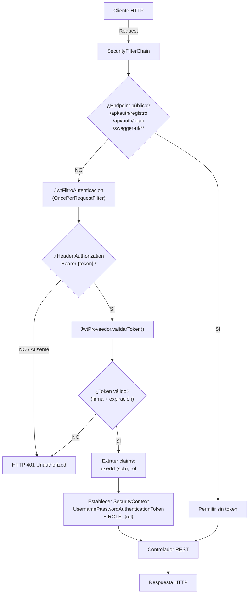
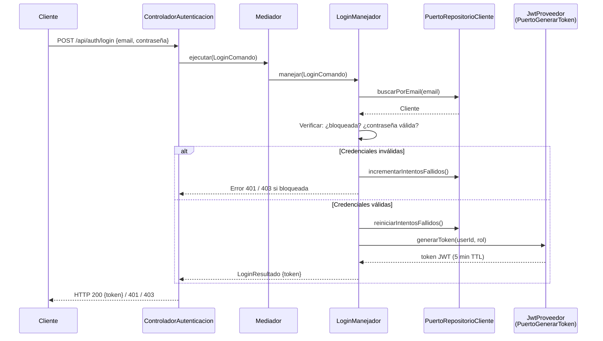

# Estrategia de Autenticación JWT y Seguridad del Sistema

> **Fecha:** 2025-07-22  
> **Dominio:** Seguridad — Autenticación y Autorización  
> **Stack:** Java 24 · Spring Boot 4.0.3 · Spring Security · JJWT 0.12.6  
> **Patrón base:** Arquitectura Hexagonal + CQRS + Mediador

---

## 🎯 **Resumen Ejecutivo**

### Propósito y alcance

- Documentar la estrategia de autenticación stateless basada en JWT implementada en el sistema BTG Pactual V2.
- El sistema protege endpoints REST mediante tokens JWT firmados con HMAC-SHA256, eliminando la necesidad de sesiones en servidor.
- La seguridad se implementa como **filtro transversal** en la cadena de Spring Security, ejecutándose antes de cualquier controlador.
- Abarca: emisión de tokens, validación por request, autorización basada en roles (`CLIENTE` / `ADMINISTRADOR`), política de bloqueo de cuentas y encriptación de credenciales con BCrypt.
- Tokens con TTL corto (5 minutos) para minimizar la ventana de exposición ante compromiso.

### Dominios y componentes críticos

- **`infrastructure/security/`** — Filtro JWT, proveedor de tokens, servicio de detalles de usuario.
- **`infrastructure/config/SecurityConfig`** — Cadena de filtros, políticas de sesión, endpoints públicos/protegidos.
- **`domain/port/out/PuertoGenerarToken`** — Puerto hexagonal que desacopla la generación de tokens del dominio.
- **`application/login/`, `application/registro/`, `application/desbloqueo/`** — Manejadores CQRS que orquestan los flujos de autenticación.

---

## 🧭 **Arquitectura de Alto Nivel**

### Cadena de seguridad — Flujo de una petición HTTP

### Flujo de emisión de token (Login)

---

## ⚙️ **Stack y Patrones Clave**

### Tecnologías que condicionan la seguridad

| Tecnología | Versión | Rol en seguridad |
|---|---|---|
| **Spring Security** | (starter, Spring Boot 4.0.3) | Cadena de filtros, gestión de `SecurityContext`, entry points |
| **JJWT** | 0.12.6 (api + impl + jackson) | Generación, firma y parsing de tokens JWT |
| **BCryptPasswordEncoder** | (Spring Security) | Hash de contraseñas en reposo |
| **HMAC-SHA256** | (vía `Keys.hmacShaKeyFor`) | Algoritmo de firma simétrica para tokens |

### Patrones arquitectónicos aplicados

- **Filtro transversal (Middleware):** `JwtFiltroAutenticacion` extiende `OncePerRequestFilter` — se ejecuta una vez por request antes del controlador, desacoplando la autenticación de la lógica de negocio.
- **Puerto hexagonal (`PuertoGenerarToken`):** La capa de aplicación invoca la generación de tokens a través de una interfaz de dominio. `JwtProveedor` es el adaptador de infraestructura que la implementa. Esto permite cambiar la estrategia de tokens sin modificar el dominio.
- **Stateless sessions:** `SessionCreationPolicy.STATELESS` elimina sesiones HTTP del servidor. Cada request se autentica de forma independiente mediante el token JWT.
- **CSRF deshabilitado:** Decisión justificada por la arquitectura stateless — sin cookies de sesión, CSRF no aplica.
- **Entry point centralizado:** `HttpStatusEntryPoint(UNAUTHORIZED)` retorna 401 sin redirección, adecuado para APIs REST.

---

## 🔗 **Integraciones Críticas**

### Flujo interno de seguridad

| Componente | Integra con | Mecanismo |
|---|---|---|
| `SecurityConfig` | `JwtFiltroAutenticacion` | `.addFilterBefore(…, UsernamePasswordAuthenticationFilter.class)` |
| `JwtFiltroAutenticacion` | `JwtProveedor` | Inyección de dependencia — valida y extrae claims |
| `LoginManejador` | `PuertoGenerarToken` | Puerto hexagonal — genera token post-autenticación |
| `LoginManejador` | `PuertoRepositorioCliente` | Busca cliente, valida credenciales, gestiona intentos fallidos |
| `DetallesUsuarioServicio` | `PuertoRepositorioCliente` | Carga usuario por email, mapea a `UserDetails` de Spring Security |
| `RegistroManejador` | `PasswordEncoder` | BCrypt para hash de contraseña en registro |

### Seguridad de integración (Auth/Authz)

- **Autorización por roles:** Spring Security evalúa authority `ROLE_CLIENTE` o `ROLE_ADMINISTRADOR` extraída del claim `rol` del JWT.
- **Aislamiento de datos:** Los endpoints protegidos utilizan el `userId` extraído del token (subject) para filtrar datos — un `CLIENTE` solo accede a sus propias suscripciones.
- **Bloqueo automático:** Tras 3 intentos fallidos consecutivos (`jwt.max-failed-attempts=3`), la cuenta se bloquea. `DetallesUsuarioServicio` refleja este estado en `enabled` y `accountNonLocked`.
- **Desbloqueo restringido:** Solo el rol `ADMINISTRADOR` puede ejecutar el flujo de desbloqueo de cuentas.

---

## 📦 **Dependencias Externas Estratégicas**

### Librerías de seguridad

| Dependencia | Scope | Propósito |
|---|---|---|
| `spring-boot-starter-security` | compile | Cadena de filtros, `SecurityContext`, `PasswordEncoder` |
| `io.jsonwebtoken:jjwt-api:0.12.6` | compile | API pública de JJWT para construir/parsear tokens |
| `io.jsonwebtoken:jjwt-impl:0.12.6` | runtimeOnly | Implementación interna de JJWT |
| `io.jsonwebtoken:jjwt-jackson:0.12.6` | runtimeOnly | Serialización JSON de claims vía Jackson |

### Configuración externalizada

| Propiedad | Valor actual | Descripción |
|---|---|---|
| `jwt.secret` | (inyectada vía `@Value`) | Clave HMAC-SHA256 — **debe rotarse y externalizarse a vault en producción** |
| `jwt.expiration-ms` | `300000` (5 min) | TTL del token — balance entre UX y seguridad |
| `jwt.max-failed-attempts` | `3` | Umbral de bloqueo automático de cuenta |

### Consideraciones de producción

- **Rotación de secreto:** El `jwt.secret` actual está en `application.properties`. En producción, debe migrarse a Azure Key Vault o variable de entorno protegida.
- **Refresh tokens:** La implementación actual no incluye refresh tokens. Con TTL de 5 minutos, el cliente debe re-autenticarse frecuentemente. Evaluar si se requiere un flujo de refresh para mejorar UX.
- **Revocación de tokens:** No existe mecanismo de revocación (blacklist/whitelist). Un token comprometido es válido hasta su expiración. El TTL corto mitiga parcialmente este riesgo.

---

## 📋 **Referencias Base**

### Documentación y fuentes analizadas

| Fuente | Ubicación | Relevancia |
|---|---|---|
| Arquitectura general del sistema | `ARQUITECTURA.md` | Cadena de filtros, roles, política de bloqueo, estructura hexagonal |
| `SecurityConfig.java` | `infrastructure/config/` | Configuración de `SecurityFilterChain`, endpoints públicos, CSRF, sesiones |
| `JwtProveedor.java` | `infrastructure/security/` | Generación y validación de tokens HMAC-SHA256 |
| `JwtFiltroAutenticacion.java` | `infrastructure/security/` | Filtro `OncePerRequestFilter`, extracción de Bearer token |
| `DetallesUsuarioServicio.java` | `infrastructure/security/` | Mapeo de `Cliente` a `UserDetails`, reflejo de estado de bloqueo |
| `PuertoGenerarToken.java` | `domain/port/out/` | Puerto hexagonal de generación de tokens |
| Historias de usuario 1.1–1.4 | `docs/stories/` | Requisitos de registro, autenticación JWT, autorización por roles, encriptación |
| Spring Security Reference | Documentación oficial | API de `SecurityFilterChain`, `OncePerRequestFilter` |
| JJWT Documentation | GitHub io.jsonwebtoken | API de construcción y parsing de JWT con HMAC-SHA256 |

---

> **Generado por:** Agente Arquitecto de Soluciones  
> **Última actualización:** 2025-07-22
